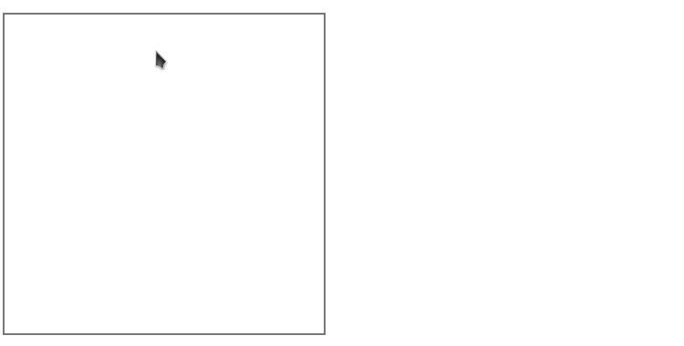

charec
======

A simple handwriting recognition in JavaScript.

Demo: http://fujimotos.github.io/charec/

How it works
------------

In [a paper published in 2004](https://scholar.google.com/scholar?cluster=2366365863084429505),
Schimke, Vielhauer and Dittmann proposed a technique to encode a
series of asynchronous events into a string.
Their target problem was "online signature authentication",
i.e. authenticating users with their electronic handwritten signatures.

To put it very shortly, they took distinct points of input function
curves (e.g. extrema and discontinuous points), represent each point
with some special string codes, and then, produce a single feature
string by arranging these codes in temporal order.

I applied the Schimke-Vielhauer-Dittman technique to a different problem
domain: "handwritten character recognition". Using DOM mouse events as
inputs, I encode the discrete stream of input events into a string.
Then, this string is used to do a nearest neighbor search on model database.

Screencast
----------

License
-------

MIT License (See LICENSE for details)
